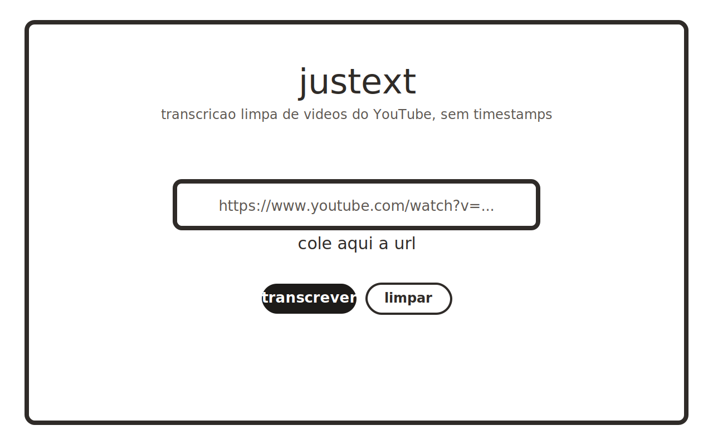

# Justext

Aplicacao web privada para extrair transcricoes limpas de videos do YouTube, sem timestamps, com autenticacao simples e interface minimalista.



## O que o produto entrega

- cola uma URL do YouTube
- busca a transcricao/legenda disponivel
- remove timestamps e junta o texto em blocos mais legiveis
- copia o texto com um clique
- exporta o resultado em `.txt`
- protege o acesso com login privado

## Arquitetura da V1

- frontend estatico servido pelo proprio backend
- backend em Node.js
- autenticacao por usuario e senha com `bcrypt`
- sessao em memoria com cookie `HttpOnly`
- rate limit basico para login e transcricao
- sem banco de dados nesta fase

Essa versao foi pensada para ser o mais simples e segura possivel antes de evoluir para uma arquitetura maior.

## Stack

- Node.js
- `bcryptjs`
- `youtube-transcript`

## Rodar localmente

```powershell
npm install
npm run start
```

Abra:

```text
http://127.0.0.1:3217
```

## Credenciais locais padrao

- usuario: `admin`
- senha: `welp`

Use isso apenas para desenvolvimento local. Em producao, troque tudo por variaveis de ambiente.

## Variaveis de ambiente

- `SOHOTEXTO_HOST`
- `SOHOTEXTO_PORT`
- `SOHOTEXTO_USER`
- `SOHOTEXTO_PASSWORD_HASH`
- `SOHOTEXTO_SESSION_SECRET`
- `SOHOTEXTO_SECURE_COOKIE`
- `YOUTUBE_INNERTUBE_ANDROID_KEY` (opcional, habilita um fallback adicional de transcricao)

Exemplo em `.env.example`.

## Gerar hash de senha

```powershell
node -e "const bcrypt=require('bcryptjs'); console.log(bcrypt.hashSync('sua-senha-aqui', 10))"
```

## Deploy rapido

### VPS

Arquivos incluidos:

- `deploy/systemd/sohotexto.service`
- `deploy/nginx/sohotexto.conf`

Fluxo sugerido:

1. clonar o repo em `/opt/sohotexto`
2. rodar `npm install`
3. configurar variaveis de ambiente
4. habilitar o service no `systemd`
5. apontar `nginx` para `127.0.0.1:3217`
6. ativar HTTPS com Let's Encrypt

### Render

Arquivo incluido:

- `render.yaml`

Defina no painel:

- `SOHOTEXTO_USER`
- `SOHOTEXTO_PASSWORD_HASH`
- `SOHOTEXTO_SESSION_SECRET`

### Railway

Arquivo incluido:

- `railway.json`

Defina as mesmas variaveis de ambiente no dashboard do Railway.

## Iniciadores locais

- `start-sohotexto.cmd`
- `tools/start-sohotexto.ps1`

## Limites conhecidos

- depende da disponibilidade de transcricao/legenda do proprio YouTube
- alguns videos podem falhar por restricoes, captcha ou indisponibilidade temporaria
- o principal ponto sensivel da solucao e a camada de captura da transcricao em ambiente publico

## Roadmap natural

- melhorar observabilidade e logs
- adicionar auditoria minima de acesso
- evoluir a sessao de memoria para store persistente se o produto crescer

## Licenca

MIT
